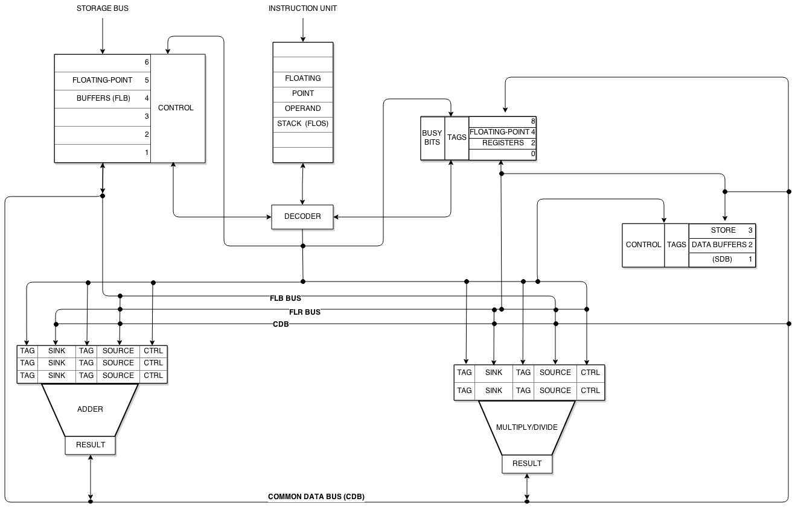

# Tomasulo Engine (RV32IF)

This repo is a full implementation of Tomasulo's out-of-order execution algorithm targeting the RV32IF subset of the RISC-V instruction set. The project has three layers that build on each other:

| Layer | What it is |
|---|---|
| [Software Simulator](docs/software-sim.md) | C++ model of the entire pipeline, cycle-accurate, with per-unit logs |
| [Hardware Simulator](docs/hardware-sim.md) | SystemVerilog simulation driven by the C++ model |
| [Hardware](docs/hardware.md) | Synthesizable RTL in Verilog/SystemVerilog |

## What is Tomasulo?

Tomasulo's algorithm is how modern CPUs execute instructions out of order without violating program correctness. The key idea is that instead of stalling the whole pipeline when an instruction is waiting on a result, you rename the destination register to a temporary tag, queue the instruction in a reservation station, and let it execute the moment its inputs arrive on the Common Data Bus. A reorder buffer keeps track of everything and commits results back to the architectural registers in order.

The figure below shows the classic block diagram:



> Figure source: Patterson and Hennessy, *Computer Organization and Design RISC-V Edition* (Fig. 3.12). You can also find an equivalent diagram on [Wikipedia](https://en.wikipedia.org/wiki/Tomasulo%27s_algorithm).

## Supported Instructions

**Integer ALU**
`ADD` `SUB` `AND` `OR` `XOR` `SLL` `SRL` `SRA`
`ADDI` `ANDI` `ORI` `XORI` `SLLI` `SRLI`

**Memory**
`LW` `SW`

**Branches**
`BEQ` `BNE` `BLT` `BGE`

**Floating Point ALU**
`FADD.S` `FSUB.S` `FMUL.S` `FDIV.S`

**Floating Point Memory**
`FLW` `FSW`

**Conversion**
`FCVT.W.S` `FCVT.S.W`

**Other**
`NOP` `HALT`

## Quick Start (Software Simulator)

The hardware sections are still a work in progress. The software simulator is fully working.

```bash
# build and run all tests
bash sim/run_tests.sh

# run a single test manually
cd sim/sim_soft/make
make
./tomasulo_sim ../../test_sim/int_alu/program.asm /tmp/out/
```

Outputs go into `logs/` (one file per pipeline unit, one line per cycle) and `final/final_regs.txt` (architectural register state at halt). See the [Software Simulator](docs/software-sim.md) page for a full walkthrough of each log file.
