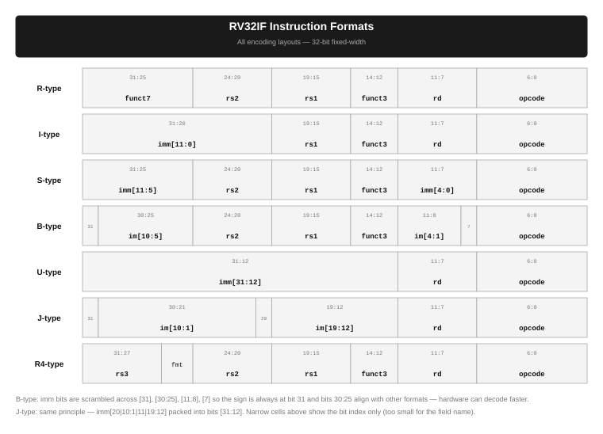
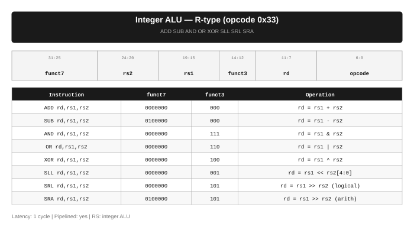
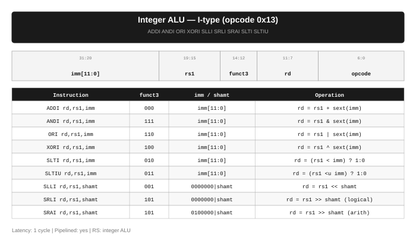
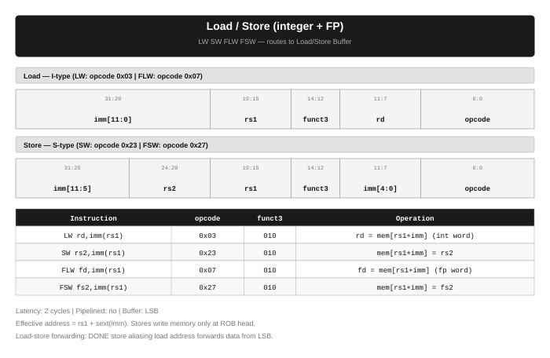
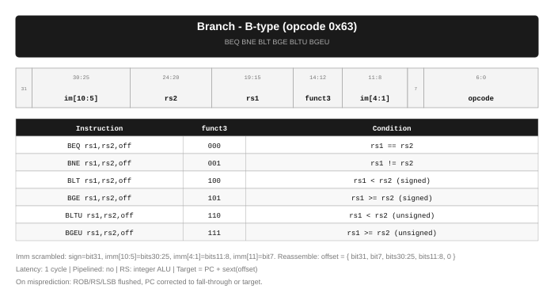
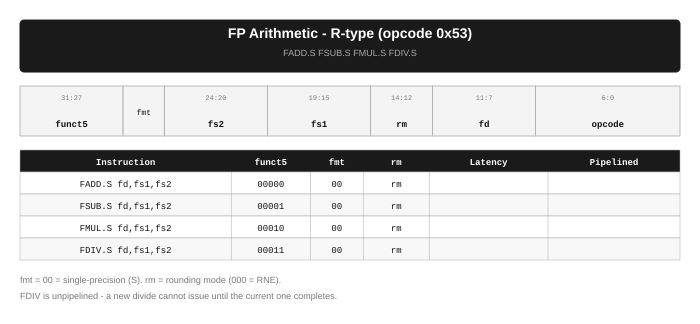
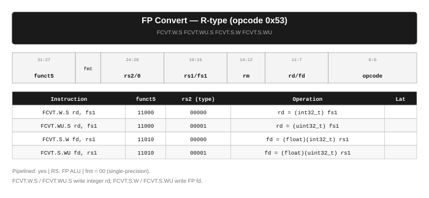

# Instruction Set Reference

This page documents every instruction supported by the Tomasulo Engine. For each group you will find the encoding diagram, a field-by-field breakdown, the operation table, and how it flows through the pipeline.

All instructions are 32-bit fixed-width. The engine targets **RV32IF** — the RISC-V 32-bit base integer ISA plus the single-precision floating-point extension.

---

## Encoding Formats at a Glance

RISC-V uses six base encoding layouts. Every instruction is exactly one of these. Several fields are at fixed bit positions across all formats so the decoder can extract them without knowing the format first:

| Fixed field | Bits | Present in |
|-------------|------|------------|
| `opcode` | 6:0 | all formats |
| `rd` | 11:7 | R, I, U, J |
| `funct3` | 14:12 | R, I, S, B |
| `rs1` | 19:15 | R, I, S, B |
| `rs2` | 24:20 | R, S, B |



| Format | Used for | Immediate |
|--------|----------|-----------|
| R-type | Register-to-register ALU and FP ops | none |
| I-type | Immediate ALU, loads | 12-bit sign-extended |
| S-type | Stores | 12-bit sign-extended, split across two fields |
| B-type | Branches | 13-bit sign-extended, scrambled |
| U-type | LUI, AUIPC | 20-bit, placed in bits 31:12 |
| J-type | JAL | 21-bit sign-extended, scrambled |

### Why are B and J immediates scrambled?

B-type and J-type pack a signed offset into non-contiguous bit slices. This is intentional:

| Reason | Detail |
|--------|--------|
| Sign always at bit 31 | Hardware sign-extends any format without knowing which one it is |
| Bits 30:25 align | Hold `imm[10:5]` in S, B, and J — one shifter covers all three |
| `rs1`/`rs2` stay fixed | Bits 19:15 and 24:20 are always source registers; the register file can be read in parallel with decode |

The scrambling only touches the assembler (encoding) and the decoder (reassembly). Execution logic never sees scrambled bits.

**B-type immediate reassembly:**

| Offset bit | Comes from instruction bit |
|------------|---------------------------|
| `[12]` (sign) | `inst[31]` |
| `[11]` | `inst[7]` |
| `[10:5]` | `inst[30:25]` |
| `[4:1]` | `inst[11:8]` |
| `[0]` | always 0 — targets are 2-byte aligned |

The narrow cells in the diagram above that show just a number (e.g. `31`, `7`, `20`) are 1-bit fields. At that width there is no room for the field name, so the bit index is shown instead.

---

## Structural Sizes

All buffer capacities are defined in `sim/sim_soft/include/config.h`. Change any constant and recompile — every component picks up the new value.

| Buffer | Config constant | Default | Role |
|--------|----------------|---------|------|
| Instruction Queue | `IQ_CAPACITY` | 8 | Fetch buffer between PC and dispatch |
| Fetch width | `IQ_FETCH_WIDTH` | 1 | Instructions dispatched per cycle |
| Reorder Buffer | `ROB_SIZE` | 16 | In-flight instruction tracking |
| Integer RS | `RS_INT_SIZE` | 6 | Slots for integer ALU and branch ops |
| FP RS | `RS_FP_SIZE` | 4 | Slots for FP arithmetic and convert ops |
| Load/Store Buffer | `LSB_SIZE` | 8 | Slots for all memory ops |
| Integer registers | `NUM_INT_REGS` | 32 | `x0`–`x31` |
| FP registers | `NUM_FP_REGS` | 32 | `f0`–`f31` |
| Data memory | `MEM_SIZE` | 1024 words | 4 KB word-addressed |

---

## Operand Resolution at Dispatch

When an instruction is dispatched from the IQ it immediately resolves its source operands. The engine checks three sources in priority order:

| Priority | Source | Condition | Result |
|----------|--------|-----------|--------|
| 1 | Register Remapping Table (RAT) | RAT has a live mapping for this register | The entry's ROB tag is recorded; operand will arrive on CDB |
| 2 | Reorder Buffer (ROB) forwarding | RAT has a mapping AND that ROB entry is already DONE | The result value is captured directly — no CDB wait |
| 3 | Architectural register file | No live RAT mapping | The committed register value is used immediately |

This is implemented in `include/dispatch_utils.h` (`resolve_operand`).

---

## Pipeline Flow

Every instruction passes through the same five stages:

| Stage | What happens |
|-------|-------------|
| **Fetch** | PC increments; instruction word placed in Instruction Queue |
| **Dispatch** | Instruction removed from IQ; ROB slot allocated; operands resolved (see table above); entry placed in RS or LSB |
| **Execute** | RS picks the entry when all operands are ready and the functional unit is free; executes for the configured number of cycles |
| **Write-back** | Result broadcast on the Common Data Bus (CDB); every RS and LSB entry watching that ROB tag captures the value |
| **Commit** | ROB head entry retires in program order; result written to architectural register file; RAT entry cleared |

Stores have a modified path — they reach DONE in the LSB but only write memory at the **Commit** stage when they reach the ROB head.

---

## Integer ALU — R-type

`ADD` `SUB` `AND` `OR` `XOR` `SLL` `SRL` `SRA`



### Fields

| Field | Bits | Purpose |
|-------|------|---------|
| `opcode` | 6:0 | `0110011` — integer register-register |
| `rd` | 11:7 | Destination register |
| `funct3` | 14:12 | Operation family (add/sub, shift, logical) |
| `rs1` | 19:15 | First source register |
| `rs2` | 24:20 | Second source register |
| `funct7` | 31:25 | Differentiates ops sharing a `funct3` (ADD vs SUB, SRL vs SRA) |

### Operations

| Instruction | funct7 | funct3 | Semantics | Notes |
|-------------|--------|--------|-----------|-------|
| `ADD` | `0000000` | `000` | `rd = rs1 + rs2` | Wraps on overflow |
| `SUB` | `0100000` | `000` | `rd = rs1 - rs2` | |
| `AND` | `0000000` | `111` | `rd = rs1 & rs2` | Bitwise |
| `OR` | `0000000` | `110` | `rd = rs1 \| rs2` | Bitwise |
| `XOR` | `0000000` | `100` | `rd = rs1 ^ rs2` | Bitwise |
| `SLL` | `0000000` | `001` | `rd = rs1 << rs2[4:0]` | Logical left, zero-fills |
| `SRL` | `0000000` | `101` | `rd = rs1 >> rs2[4:0]` | Logical right, zero-fills |
| `SRA` | `0100000` | `101` | `rd = rs1 >> rs2[4:0]` | Arithmetic right, sign-fills |

### Pipeline routing

| Property | Value |
|----------|-------|
| Dispatched to | Integer Reservation Station (`RS_INT_SIZE` slots) |
| Functional unit | Integer ALU |
| Latency | 1 cycle |
| Pipelined | yes — accepts a new op every cycle |
| Result destination | Integer register file (`x0`–`x31`) |
| `x0` behaviour | Reads always return 0; writes are silently discarded |

---

## Integer ALU — I-type

`ADDI` `ANDI` `ORI` `XORI` `SLTI` `SLTIU` `SLLI` `SRLI` `SRAI`



### Fields

| Field | Bits | Purpose |
|-------|------|---------|
| `opcode` | 6:0 | `0010011` — integer immediate |
| `rd` | 11:7 | Destination register |
| `funct3` | 14:12 | Operation selector |
| `rs1` | 19:15 | Source register |
| `imm[11:0]` | 31:20 | 12-bit immediate, sign-extended to 32 bits before use |

For the shift instructions the immediate field doubles as an encoded sub-opcode plus a 5-bit shift amount:

| Bits | Field | SLLI / SRLI | SRAI |
|------|-------|-------------|------|
| `inst[31:25]` | upper immediate | `0000000` | `0100000` |
| `inst[24:20]` | `shamt[4:0]` | shift amount 0–31 | shift amount 0–31 |

### Operations

| Instruction | funct3 | Semantics | Notes |
|-------------|--------|-----------|-------|
| `ADDI` | `000` | `rd = rs1 + sext(imm)` | `ADDI x0,x0,0` is `NOP` |
| `ANDI` | `111` | `rd = rs1 & sext(imm)` | |
| `ORI` | `110` | `rd = rs1 \| sext(imm)` | |
| `XORI` | `100` | `rd = rs1 ^ sext(imm)` | |
| `SLTI` | `010` | `rd = (rs1 < sext(imm)) ? 1 : 0` | Signed comparison |
| `SLTIU` | `011` | `rd = (rs1 <u sext(imm)) ? 1 : 0` | Unsigned comparison |
| `SLLI` | `001` | `rd = rs1 << shamt` | |
| `SRLI` | `101` | `rd = rs1 >> shamt` | Logical, zero-fills |
| `SRAI` | `101` | `rd = rs1 >> shamt` | Arithmetic, sign-fills; `imm[10]=1` distinguishes from SRLI |

### Pipeline routing

| Property | Value |
|----------|-------|
| Dispatched to | Integer Reservation Station |
| Functional unit | Integer ALU |
| Latency | 1 cycle |
| Pipelined | yes |
| Result destination | Integer register file |

---

## Load / Store

`LW` `SW` `FLW` `FSW`



### Load encoding (I-type)

| Field | Bits | Purpose |
|-------|------|---------|
| `opcode` | 6:0 | `0000011` (LW) or `0000111` (FLW) |
| `rd` | 11:7 | Destination — integer `rd` for LW, FP `fd` for FLW |
| `funct3` | 14:12 | `010` — word width |
| `rs1` | 19:15 | Base address register |
| `imm[11:0]` | 31:20 | Signed byte offset |

### Store encoding (S-type)

The immediate is split to keep `rs1` and `rs2` at their fixed positions:

| Field | Bits | Immediate bits |
|-------|------|----------------|
| `imm[4:0]` | 11:7 | lower 5 bits of offset |
| `imm[11:5]` | 31:25 | upper 7 bits of offset |

Reassemble: `imm = { inst[31:25], inst[11:7] }`, then sign-extend.

### Instruction table

| Instruction | opcode | funct3 | Operation |
|-------------|--------|--------|-----------|
| `LW` | `0000011` | `010` | `rd = mem[rs1 + sext(imm)]` |
| `SW` | `0100011` | `010` | `mem[rs1 + sext(imm)] = rs2` |
| `FLW` | `0000111` | `010` | `fd = mem[rs1 + sext(imm)]` |
| `FSW` | `0100111` | `010` | `mem[rs1 + sext(imm)] = fs2` |

### Load lifecycle in the LSB

| State | Condition to advance | What happens |
|-------|---------------------|-------------|
| `WAITING` | CDB broadcasts base register value | Operand captured; effective address = `rs1 + sext(imm)` computed |
| `ADDR_READY` | No earlier store aliases this address (or aliasing store is DONE) | Load begins memory access or forwards data from LSB |
| `EXECUTING` | `cycles_rem` countdown reaches 0 | Memory word read; result placed in entry |
| `DONE` | — | Result broadcast on CDB; slot freed after commit |

**Aliasing rules for loads:** when an earlier store is in the LSB with the same effective address, the load checks its state:

| Earlier store state | Load action |
|--------------------|-------------|
| `WAITING` — address not yet known | Load is blocked |
| `ADDR_READY` or `EXECUTING` — address known, data not yet | Load is blocked |
| `DONE` — address and data both known | Load gets the data directly from the LSB entry (no memory access) |
| Non-aliasing address (any state) | Load proceeds |

### Store lifecycle

Stores never write memory inside the pipeline. They sit in the LSB until the **CommitUnit** sees the store at the ROB head, then `commit_store()` writes the word to memory and frees the slot. This guarantees in-order memory writes regardless of out-of-order dispatch.

### Pipeline routing

| Property | Value |
|----------|-------|
| Dispatched to | Load/Store Buffer (`LSB_SIZE` slots, circular, program-order) |
| Latency | 2 cycles |
| Pipelined | no — one memory access in flight at a time |
| Memory | Word-addressed; byte address = word index x 4; `MEM_SIZE` = 1024 words |
| Store commit | At ROB head only, via `CommitUnit::commit_store()` |

---

## Branch

`BEQ` `BNE` `BLT` `BGE` `BLTU` `BGEU`



### Fields (B-type)

| Field | Bits | Immediate bit carried |
|-------|------|-----------------------|
| `opcode` | 6:0 | `1100011` |
| `imm[11]` | 7 | offset bit 11 |
| `imm[4:1]` | 11:8 | offset bits 4:1 |
| `funct3` | 14:12 | condition selector |
| `rs1` | 19:15 | left comparand |
| `rs2` | 24:20 | right comparand |
| `imm[10:5]` | 30:25 | offset bits 10:5 |
| `imm[12]` | 31 | offset sign bit |

Offset bit 0 is always 0 — branch targets must be 2-byte aligned. Full reassembly:

```
offset = sext({ inst[31], inst[7], inst[30:25], inst[11:8], 1'b0 })
```

### Conditions

| Instruction | funct3 | Comparison type | Branch taken when |
|-------------|--------|-----------------|-------------------|
| `BEQ` | `000` | equality | `rs1 == rs2` |
| `BNE` | `001` | inequality | `rs1 != rs2` |
| `BLT` | `100` | signed less-than | `rs1 < rs2` |
| `BGE` | `101` | signed greater-or-equal | `rs1 >= rs2` |
| `BLTU` | `110` | unsigned less-than | `rs1 < rs2` (unsigned) |
| `BGEU` | `111` | unsigned greater-or-equal | `rs1 >= rs2` (unsigned) |

### Branch resolution

| Event | Outcome |
|-------|---------|
| Dispatch | Instruction placed in integer RS; operands resolved normally |
| Both `rs1` and `rs2` ready | RS computes condition and target `PC + offset` |
| Prediction | Not-taken — fetch continues sequentially from `PC + 4` |
| Branch not taken (prediction correct) | ROB entry commits silently; no pipeline change |
| Branch taken (misprediction) | ROB, RS, and LSB fully flushed; PC redirected to target; RAT restored |

### Pipeline routing

| Property | Value |
|----------|-------|
| Dispatched to | Integer Reservation Station |
| Functional unit | Integer ALU |
| Latency | 1 cycle |
| Pipelined | no |
| Branch prediction | Predict not-taken |
| Misprediction penalty | Full pipeline flush + PC redirect |

---

## FP Arithmetic

`FADD.S` `FSUB.S` `FMUL.S` `FDIV.S`



### Fields (R-type, opcode `0x53`)

| Field | Bits | Purpose |
|-------|------|---------|
| `opcode` | 6:0 | `1010011` |
| `fd` | 11:7 | Destination FP register |
| `rm` | 14:12 | Rounding mode |
| `fs1` | 19:15 | First FP source |
| `fs2` | 24:20 | Second FP source |
| `fmt` | 26:25 | Precision: `00` = single (S) |
| `funct5` | 31:27 | Operation selector |

### Operations

| Instruction | funct5 | Operation | IEEE 754 |
|-------------|--------|-----------|----------|
| `FADD.S` | `00000` | `fd = fs1 + fs2` | yes |
| `FSUB.S` | `00001` | `fd = fs1 - fs2` | yes |
| `FMUL.S` | `00010` | `fd = fs1 * fs2` | yes |
| `FDIV.S` | `00011` | `fd = fs1 / fs2` | yes |

### Rounding modes (`rm` field)

| `rm` encoding | Name | Rule |
|---------------|------|------|
| `000` | RNE | Round to nearest, ties to even |
| `001` | RTZ | Round towards zero (truncate) |
| `010` | RDN | Round towards negative infinity (floor) |
| `011` | RUP | Round towards positive infinity (ceiling) |
| `100` | RMM | Round to nearest, ties to max magnitude |

### Pipeline routing

| Instruction | Latency | Pipelined | Notes |
|-------------|---------|-----------|-------|
| `FADD.S` | 2 cycles | yes | One result per cycle after fill |
| `FSUB.S` | 2 cycles | yes | One result per cycle after fill |
| `FMUL.S` | 4 cycles | yes | One result per cycle after fill |
| `FDIV.S` | 8 cycles | **no** | Next divide must wait for current to complete |

| Property | Value |
|----------|-------|
| Dispatched to | FP Reservation Station (`RS_FP_SIZE` slots) |
| Result destination | FP register file (`f0`–`f31`) |
| Latencies configured in | `sim/sim_soft/include/config.h` |

---

## FP Convert

`FCVT.W.S` `FCVT.WU.S` `FCVT.S.W` `FCVT.S.WU`



### Fields (R-type, opcode `0x53`)

| Field | Bits | Purpose |
|-------|------|---------|
| `opcode` | 6:0 | `1010011` |
| `rd / fd` | 11:7 | Destination — integer file for float-to-int, FP file for int-to-float |
| `rm` | 14:12 | Rounding mode (same encoding as FP arithmetic) |
| `rs1 / fs1` | 19:15 | Source — FP file for float-to-int, integer file for int-to-float |
| `rs2` | 24:20 | Conversion sub-type: `00000` = signed, `00001` = unsigned |
| `fmt` | 26:25 | `00` = single-precision |
| `funct5` | 31:27 | Direction: `11000` = float-to-int, `11010` = int-to-float |

### Operations

| Instruction | funct5 | rs2 | Source reg file | Destination reg file | Semantics |
|-------------|--------|-----|-----------------|----------------------|-----------|
| `FCVT.W.S` | `11000` | `00000` | FP (`fs1`) | Integer (`rd`) | `rd = (int32_t) fs1` |
| `FCVT.WU.S` | `11000` | `00001` | FP (`fs1`) | Integer (`rd`) | `rd = (uint32_t) fs1` |
| `FCVT.S.W` | `11010` | `00000` | Integer (`rs1`) | FP (`fd`) | `fd = (float)(int32_t) rs1` |
| `FCVT.S.WU` | `11010` | `00001` | Integer (`rs1`) | FP (`fd`) | `fd = (float)(uint32_t) rs1` |

The ROB entry carries a `rd_fp` flag. At commit the `CommitUnit` reads this flag to decide which register file to write.

### Pipeline routing

| Property | Value |
|----------|-------|
| Dispatched to | FP Reservation Station |
| Latency | 2 cycles |
| Pipelined | yes |

---

## NOP and HALT

| Mnemonic | Encoding | Effect |
|----------|----------|--------|
| `NOP` | Standard RISC-V `ADDI x0, x0, 0` | Advances PC; no register write |
| `HALT` | Custom immediate on the `NOP` encoding | Stops the simulation clock |

`HALT` is not a real RISC-V instruction. The assembler emits a special immediate value that the simulator's fetch stage detects, drains all in-flight instructions, then writes `final/final_regs.txt` before exiting.

---

## Register Files

### Integer registers — `x0`–`x31`

| Register | ABI name | Conventional role |
|----------|----------|-------------------|
| `x0` | `zero` | Hardwired 0 — reads return 0, writes ignored |
| `x1` | `ra` | Return address |
| `x2` | `sp` | Stack pointer |
| `x3` | `gp` | Global pointer |
| `x4` | `tp` | Thread pointer |
| `x5`–`x7` | `t0`–`t2` | Caller-saved temporaries |
| `x8`–`x9` | `s0`–`s1` | Callee-saved |
| `x10`–`x17` | `a0`–`a7` | Function arguments / return values |
| `x18`–`x27` | `s2`–`s11` | Callee-saved |
| `x28`–`x31` | `t3`–`t6` | Caller-saved temporaries |

The simulator accepts both `x`-numbered names and ABI aliases in assembly source.

### FP registers — `f0`–`f31`

| Register | ABI name | Conventional role |
|----------|----------|-------------------|
| `f0`–`f7` | `ft0`–`ft7` | FP temporaries |
| `f8`–`f9` | `fs0`–`fs1` | FP callee-saved |
| `f10`–`f11` | `fa0`–`fa1` | FP arguments / return values |
| `f12`–`f17` | `fa2`–`fa7` | FP arguments |
| `f18`–`f27` | `fs2`–`fs11` | FP callee-saved |
| `f28`–`f31` | `ft8`–`ft11` | FP temporaries |

All 32 FP registers hold IEEE 754 single-precision values. The simulator stores them internally as raw `uint32_t` bit patterns and reinterprets via `bits_to_float` / `float_to_bits` (`include/utils.h`) to avoid undefined behaviour from type-punning.

---

## Timing Summary — Software Simulator

All values are in clock cycles. Constants are in `sim/sim_soft/include/config.h` — change any value and recompile; every component picks it up automatically.

| Group | Instructions | Latency | Pipelined | Dispatched to | Result to |
|-------|-------------|---------|-----------|---------------|-----------|
| Integer ALU | ADD SUB AND OR XOR SLL SRL SRA | 1 | yes | Int RS | Int RF |
| Integer imm | ADDI ANDI ORI XORI SLTI SLTIU SLLI SRLI SRAI | 1 | yes | Int RS | Int RF |
| Load | LW FLW | 2 | no | LSB | Int or FP RF |
| Store | SW FSW | 2 | no | LSB | memory (at commit) |
| Branch | BEQ BNE BLT BGE BLTU BGEU | 1 | no | Int RS | PC only |
| FP add/sub | FADD.S FSUB.S | 2 | yes | FP RS | FP RF |
| FP multiply | FMUL.S | 4 | yes | FP RS | FP RF |
| FP divide | FDIV.S | 8 | **no** | FP RS | FP RF |
| FP convert | FCVT.W.S FCVT.WU.S FCVT.S.W FCVT.S.WU | 2 | yes | FP RS | Int or FP RF |
| NOP / HALT | NOP HALT | 1 | no | Int RS | — |

---

## Timing Summary — Hardware

> **Work in progress.** The hardware implementation (SystemVerilog RTL) is not yet complete. This table will be filled in with measured post-synthesis cycle counts once the hardware simulator is functional. See [hardware-sim.md](hardware-sim.md) and [hardware.md](hardware.md) for current status.

| Group | Instructions | Target latency | Pipelined | Notes |
|-------|-------------|----------------|-----------|-------|
| Integer ALU | ADD SUB AND OR XOR … | TBD | TBD | |
| Load / Store | LW SW FLW FSW | TBD | TBD | |
| Branch | BEQ BNE BLT BGE … | TBD | TBD | |
| FP add/sub | FADD.S FSUB.S | TBD | TBD | |
| FP multiply | FMUL.S | TBD | TBD | |
| FP divide | FDIV.S | TBD | TBD | |
| FP convert | FCVT.W.S … | TBD | TBD | |
