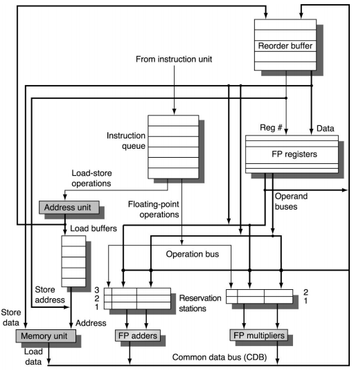

# Hardware (Verilog/SystemVerilog)

[Back to root](../README.md)

This section covers the synthesizable RTL implementation of the Tomasulo engine. The hardware directly mirrors the software simulator's pipeline structure so the two can be developed and verified side by side.

## Status

> Work in progress. RTL modules are being added as the software simulator is validated.

## Design Parameters

The RTL uses the same constants as the software simulator. Latencies and structural sizes are set at elaboration time through SystemVerilog parameters, which correspond 1:1 with the `config.h` values.

| Parameter | Default | Meaning |
|---|---|---|
| `IQ_FETCH_WIDTH` | 1 | instructions issued per cycle |
| `ROB_SIZE` | 16 | reorder buffer depth |
| `RS_INT_SIZE` | 6 | integer RS entries |
| `RS_FP_SIZE` | 4 | FP RS entries |
| `LSB_SIZE` | 8 | load/store buffer entries |
| `LAT_INT_ALU` | 1 | integer ALU pipeline depth |
| `LAT_FP_MUL` | 4 | FP multiply pipeline depth |
| `LAT_FP_DIV` | 8 | FP divide pipeline depth |

## Verification Plan

Each RTL module is tested by driving it with the C++ software simulator running in co-simulation mode. The C++ model generates a stimulus trace and expected output for every cycle; the SystemVerilog testbench applies the same stimulus and checks that the RTL matches. Any mismatch triggers an assertion failure with the cycle number and the differing signal values.

See [Hardware Simulator](hardware-sim.md) for how the co-simulation is set up.

## Figure Reference

The block diagram below (from Patterson and Hennessy) maps directly to the module hierarchy above. The ROB is the component added to the classic Tomasulo design to allow precise exceptions and in-order commit.

> Figure source: Patterson and Hennessy, *Computer Organization and Design RISC-V Edition*. An equivalent public domain version is available on [Wikipedia](https://en.wikipedia.org/wiki/Tomasulo%27s_algorithm#Reorder_buffer).
